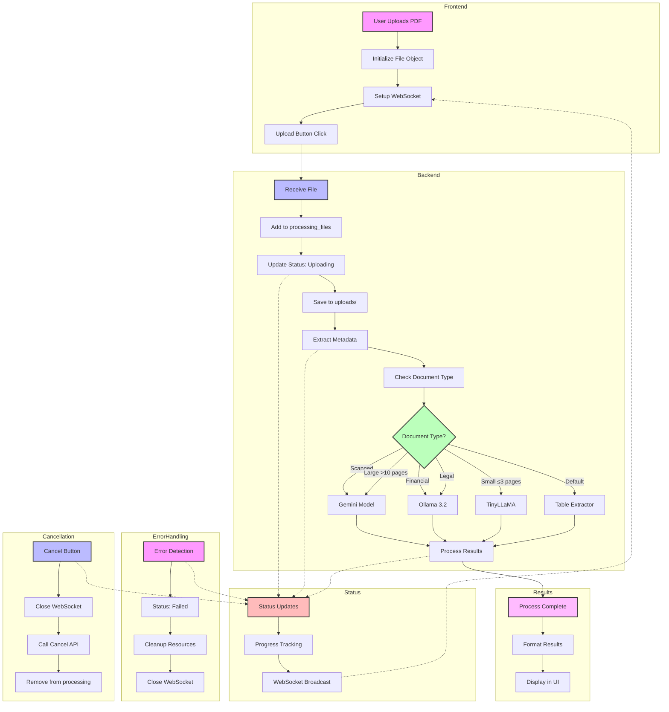

# Document Processing Platform – LLM-Driven PDF Processor

A full-stack application that allows users to upload PDF documents and automatically routes them through specialized LLMs based on their type and size. It supports scanned PDFs (OCR), legal and financial document parsing, and real-time status updates.

# Document Processing Pipeline

## Complete System Flow



## Detailed Process Steps

1. **Frontend Initialization**
   - User uploads PDF
   - File object created with properties:
     ```javascript
     {
         file: file,
         name: file.name,
         size: (file.size / 1024).toFixed(2) + ' KB',
         status: '',
         progress: 0,
         result: null,
         error: null,
         ws: null,
         isProcessing: false
     }
     ```
   - WebSocket connection established: `ws://localhost:8000/ws/status/{filename}`

2. **Backend Processing**
   - File received at `/api/upload/`
   - Added to `processing_files` set
   - Status updates:
     - "Uploading" (20%)
     - "Extracting" (40%)
     - "Processing" (60%)
     - "Extracted" (80%)
     - "Completed" (100%)
     - "Failed" (0%)

3. **Document Processing**
   - Metadata extraction
   - Document type detection
   - Model selection:
     - Gemini: Scanned/Large documents
     - Ollama 3.2: Financial/Legal documents
     - TinyLLaMA: Small documents
     - Standard Table Extractor: Default

4. **Error Handling**
   - Status updates to "Failed"
   - Error message display
   - Resource cleanup
   - WebSocket closure

5. **Cancellation**
   - WebSocket connection closure
   - Cancel API call
   - Processing removal
   - Status update to "Stopped"

6. **Result Display**
   - Results formatting
   - UI update with metadata
   - Model information display
   - React-markdown rendering

7. **Cleanup**
   - WebSocket connections closed
   - Files removed from processing
   - UI status updates
   - Resource cleanup
```

## Process Steps

1. **Upload**: User uploads a PDF document
2. **Analysis**: System analyzes document type and characteristics
3. **Processing**: Document is processed by the most suitable model:
   - Gemini: For scanned documents or large files (>10 pages)
   - Ollama 3.2: For financial or legal documents
   - TinyLLaMA: For small documents (≤3 pages)
   - Standard Table Extractor: For all other documents
4. **Results**: System generates and displays results to user
5. **Progress**: Real-time updates show processing status

---

## Frontend Implementation – React.js

The frontend of the application is built using **React.js**, providing an intuitive and responsive interface for:

- Uploading documents  
- Receiving real-time status updates  
- Viewing extracted outputs (tables, summaries)

### Tools and Libraries Used

| Tool/Library       | Purpose                                                         |
| ------------------ | --------------------------------------------------------------- |
| React.js           | Builds dynamic, responsive UI components                        |
| Material-UI        | Provides polished, pre-designed UI components                   |
| react-dropzone     | Enables smooth drag-and-drop or manual file uploads             |
| react-query        | Manages API state, caching, and reactivity for smoother updates |
| react-markdown     | Renders extracted markdown (e.g., tables/summaries) into HTML   |
| Socket.IO          | Supports real-time communication between frontend and backend   |

### Rationale for Tool Selection

- **React.js**: Ideal for dynamic UI with real-time updates  
- **Material-UI**: Speeds up styling and maintains a consistent design  
- **react-dropzone**: Provides a user-friendly drag-and-drop interface  
- **react-query**: Optimizes performance with smart caching and re-fetching  
- **react-markdown**: Ensures clean rendering of LLM-generated markdown  
- **Socket.IO**: Enables real-time progress tracking without page refreshes

### Core Features

- **File Upload**: Drag-and-drop or manual upload via `react-dropzone`, sent to `/upload`  
- **Real-Time Status Dashboard**: Tracks states (Uploading → Extracting → Processing → Completed/Failed) via WebSocket (or polling fallback)  
- **Progress Visualization**: Color-coded badges and progress bar show live processing status  
- **Markdown Output**: Extracted summaries/tables rendered cleanly using `react-markdown`  
- **Error Handling**: Handles backend failures or unsupported formats with visible feedback

---

## Backend Implementation – FastAPI & LLM Routing

The backend uses **FastAPI** for asynchronous API management and document routing based on type, size, and content using LangChain and multiple LLMs.

### Tools and Libraries Used

| Tool/Library    | Purpose                                                          |
| --------------- | ---------------------------------------------------------------- |
| FastAPI         | Fast, asynchronous API development                               |
| PyPDF2          | Extracts document metadata                                       |
| pdf2image       | Converts PDFs into images for OCR                                |
| pytesseract     | Performs OCR on scanned PDF images                               |
| LangChain       | Routes inputs to appropriate LLM based on rules                  |
| Socket.IO       | Sends real-time document status to frontend                      |
| TinyLLaMA       | Efficient model for short documents                              |
| Gemini          | Used for scanned and large documents (multimodal & long context) |
| Ollama 3.2      | Specialized in parsing legal and financial documents             |

### Rationale for Tool Selection

- **FastAPI**: Lightweight, async-capable API ideal for concurrent processing tasks  
- **pdf2image + pytesseract**: Extracts text from scanned images using Tesseract OCR  
- **LangChain**: Central logic to route documents based on size/type to the right LLM  
- **Socket.IO**: Real-time updates pushed to frontend for each processing stage  
- **TinyLLaMA**: Low-latency and cost-efficient for simple documents  
- **Gemini**: Handles complex scanned or large PDFs using its multimodal capability  
- **Ollama**: Efficient at parsing structured and domain-specific data (contracts, tables)

---

## Model Selection Rationale

| Model          | Use Case                              | Why Selected                                                   |
| -------------- | ------------------------------------- | -------------------------------------------------------------- |
| TinyLLaMA      | Short/general documents (≤3 pages)    | Fast, cost-effective for basic content                         |
| Gemini         | Scanned PDFs or Long Docs (>10 pages) | Multimodal + large context window, ideal for long/complex docs |
| Ollama 3.2     | Legal and financial documents         | Specializes in domain-specific structure and table extraction  |

### Cost-Effectiveness Note

While powerful models like GPT-4 or Claude offer advanced features, we prioritized TinyLLaMA and Ollama for their balance of performance and cost-efficiency. These models deliver fast, specialized outputs for smaller or niche documents — avoiding the expense of premium models where unnecessary.

---

## Model Routing Logic

The system uses a rule-based LLM router for optimal model selection. This ensures each document is handled by the most capable and cost-efficient model.

| Check Priority        | Condition                       | Model Used               |
| --------------------- | ------------------------------- | ------------------------ |
| 1. Scanned Document   | Detected via OCR need           | Gemini                   |
| 2. Large Document     | More than 10 pages              | Gemini                   |
| 3. Financial Document | Detected via metadata/text cues | Ollama 3.2               |
| 4. Legal Document     | Detected via keywords/context   | Ollama 3.2               |
| 5. Small Document     | 3 pages or fewer                | TinyLLaMA                |
| 6. Fallback           | All else                        | Standard Table Extractor |

This routing ensures optimal accuracy, performance, and resource usage.

---

## How It Works (Flow Summary)

1. User uploads file (via React Dropzone)  
2. Backend receives document and begins processing  
3. OCR check: If scanned, convert pages to images and apply OCR using Tesseract  
4. Metadata and content extraction using PyPDF2  
5. LLM routing via LangChain using defined rules  
6. Chosen model processes content, generates structured output in Markdown  
7. Real-time updates sent to frontend via WebSocket  
8. Frontend displays output by rendering Markdown as readable HTML

---

## Final Highlights

- Smart model selection for cost-effective, accurate results  
- Real-time feedback from backend to frontend  
- Support for multiple document types (legal, financial, scanned, general)  
- Modular backend with clean LLM abstraction and extendability  
- Prioritized performance and cost-efficiency using open-source models


---
## Setup and Installation

### 1. Clone the Repository
```bash
git clone https://github.com/your-username/document-processing-system.git
cd document-processing-project
```

### 2. Backend Setup (FastAPI)
```bash
# Create and activate virtual environment
python -m venv venv

# Windows
venv\Scripts\activate

# macOS/Linux
source venv/bin/activate

# Install dependencies
pip install -r requirements.txt
```

Create `.env` file in backend root:
```env
GEMINI_API_KEY="GEMINI KEY"
HF_TOKEN="HUGGING FACE TOKEN"
```

Run the FastAPI server:
```bash
uvicorn main:app --reload
```
Backend will be available at: http://localhost:8000

### 3. Frontend Setup (React.js)
```bash
cd frontend
npm install
```

Create `.env` file in frontend root:
```env
REACT_APP_API_URL=http://localhost:8000
```

Run the React development server:
```bash
npm start
```
Frontend will be available at: http://localhost:3000

## Testing the Application

1. Open your browser and go to: http://localhost:3000
2. Upload different types of PDF documents
3. Monitor real-time status updates:
   - Uploading → Extracting → Processing → Completed
4. Processed results (summaries, tables, text) will appear in the UI with Markdown formatting
